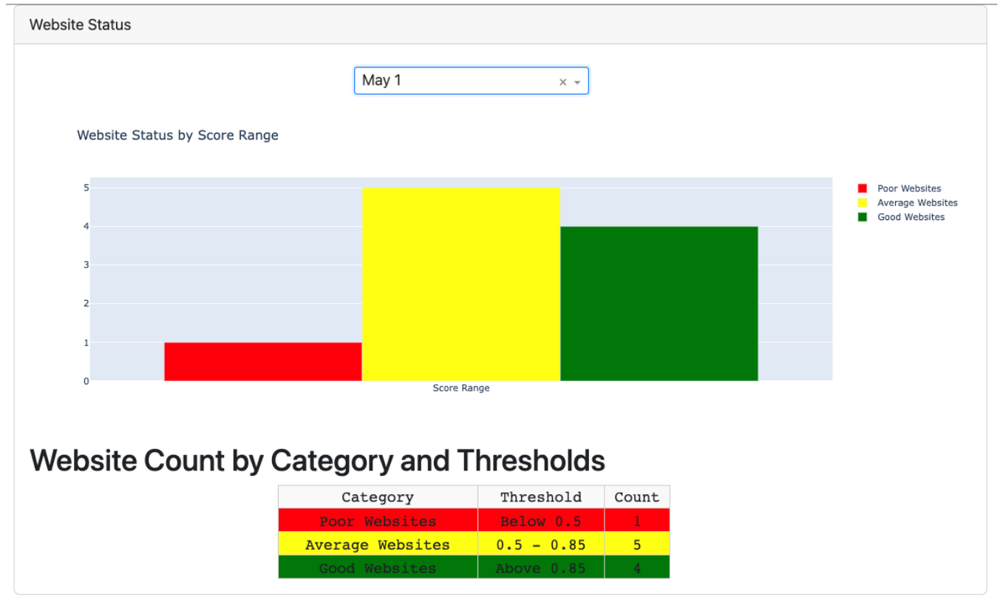
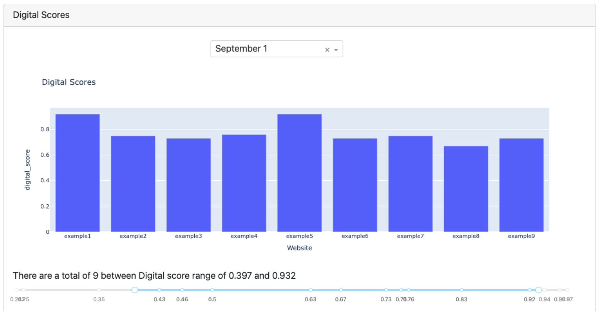
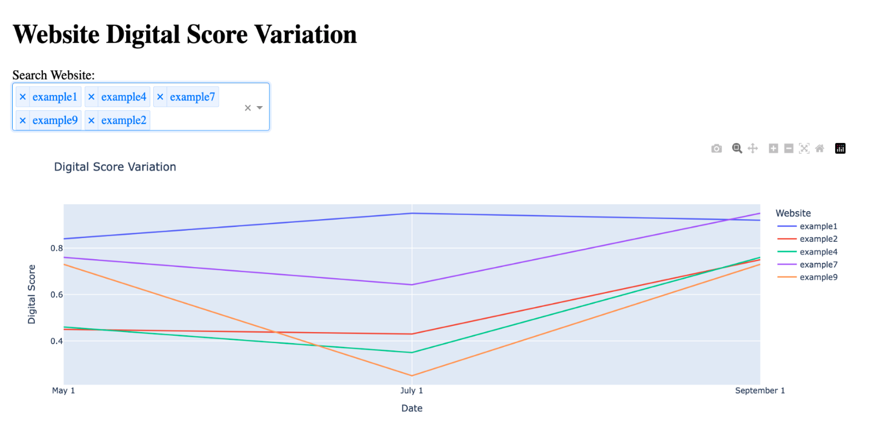
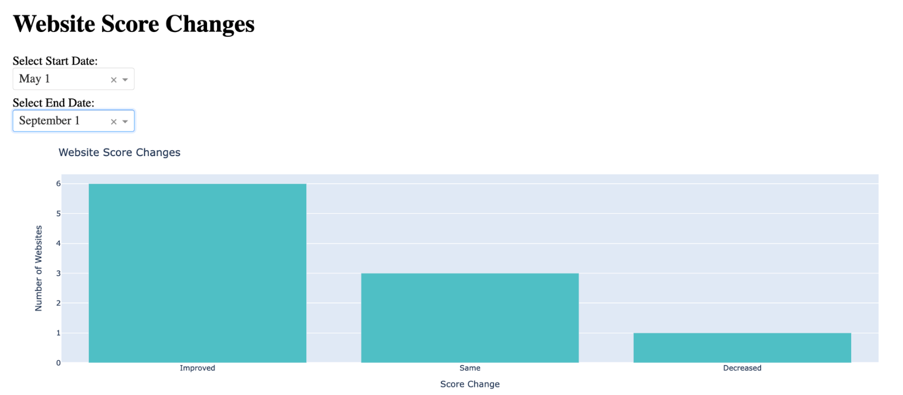
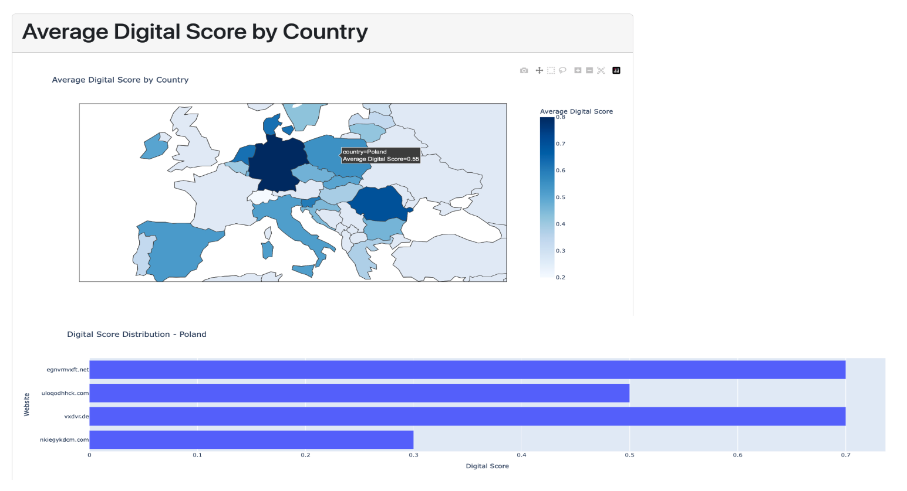
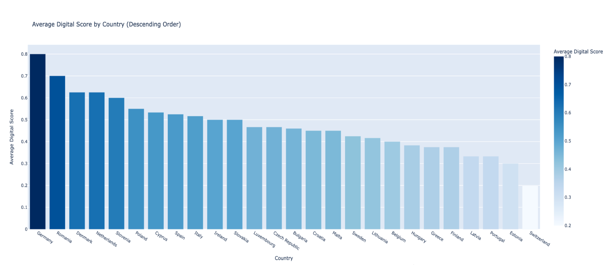

# Assessing Digitalization of European Communities

To develop a methodology to measure and visualize the digitization level of communities based on their website features.

### **Data Scraping**

Different .ipynb notebooks were created for scraping data for different features

### **Digitisation Score Calculation**

**xgboost.ipynb**  provides the intuition on how an ML model can be trained on these features to learn the weights. These weights can then be used to provide the digitisation scores to the websites based on the data scraped through the individual .ipynb scripts

### **Visualisation features**

- Count of websites in different categories - Poor, Average, Good
- Slider to navigate between any ranges of digital scores and drill down to view specific features
- How websites digitisation changes over time
- Interactive world map showing the average digital score by country
- Bar chart displaying the digital score distribution for each country
- Clicking on a country in the world map updates the bar chart and displays the websites for that country
- Clicking on a bar in the bar chart updates the displayed websites

## **Getting Started**

### **Clone the Repository**


```shell
git clone https://github.com/kartikeysharma95UZH/digi_score.git
```

### **Setting up the Environment**

- Navigate to the project directory:
```shell
cd digi_score/visualisation_plotly_dash_code
```

### **Create and activate a virtual environment (optional, but recommended):**

```shell
python3 -m venv env      # Create a virtual environment
source env/bin/activate # Activate the virtual environment
```

### **Install the required packages from the requirements.txt file:**

```shell
pip install -r requirements.txt
```
This will install all the necessary packages and their specific versions for the project.

## **Running the Application**

To run the Dash application, use the following command:

```shell
python home.py
```



```shell
python page1.py
```



```shell
python linechart.py
```


```shell
python over_time.py
```


```shell
python geography.py
```



## **Dataset**


The dataset used for this project is locations_100.csv, which contains information about website locations and their digital scores.


